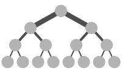
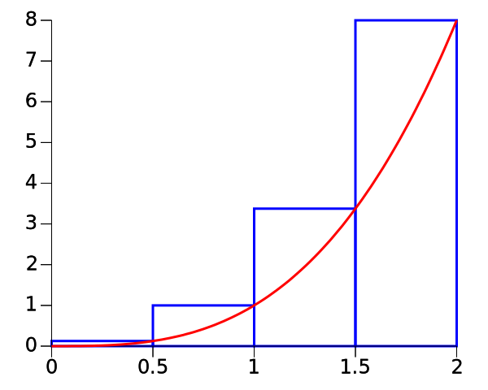
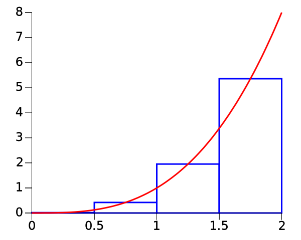
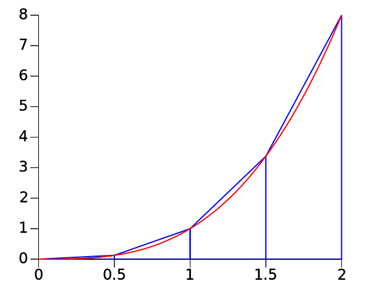
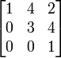
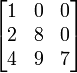
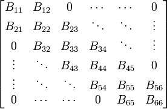
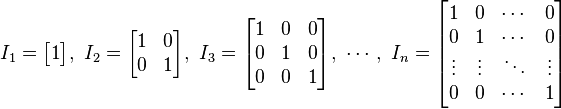
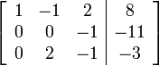
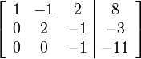

# Final Study Guide

by Chris Knadler (<3)

## Move To Multicore

The move to multicore started with the "power wall". While the number of transistors one can fit on a chip doubles ever two years (according to Moore's law), the power and clock speed of a single chip cannot scale in the same manner.

Clock speeds of modern CPUs have not increased notably in the last decade. The move has been towards multicore systems out of necessity. Smaller, more power efficient cores working together can parallelize tasks and attain higher performance within the clock speed and power constraints.

## Flynn's Taxonomy

__SISD:__

Single Instruction, Single Data. This is the simplest of CPUs. It offers no parallelism and can only execute one instruction and read one chunk of data at a time.

__SIMD:__

Single Instruction, Multiple Data. Pulls from multiple data streams against a single instruction stream. A good example of this would be a GPU or an Array Processor.

__MISD:__

Multiple Instruction, Single Data. Extremely uncommon. Multiple instructions that can only operate on a single data stream. Common in fault tolerant systems.

__MIMD:__

Multiple Instruction, Multiple Data. Execute multiple instructions on multiple streams of data. Examples would be distributed systems, multicore CPUs. Distributed systems can either use a shared memory or distributed memory space in a MIMD system.

## Memory

__Shared Memory:__

TODO…

__Distributed Memory:__

TODO...

## Interconnect Topologies

__Cluster:__

Hetrogenous group of interconnected computers, via ethernet.

__Fat Tree:__



A tree that doubles in throughput each level you move up.

## Programming For Parallelism

Both processes and threads are independent sequences of execution.

__Processes:__

* Processes have their own virtual memory
* They are always managed by the kernel
* They have their own PCB (process control block)
* Have their own stack and heap
* Processes are insulated from eachother

__Threads:__

* Threads are a subset of a process
* They share their processes virtual memory
* All processes have at least one thread
* Threads are tied to one single process

## Multiple Process Multiple Data variances

__SPMD:__

Multiple autonomous processors simultaneously executing the same program on different sets of data. An example of this would be to run all of the test cases for our last assignment simultaneously.

__MPMD:__

Mutiple autonomous processors simultaneously executing different programs on different indepentent sets of data.

## Synchronization

__DAG (Directed Acyclic Graph):__

A Directed Acyclic Graph is a graph that contains no cycles an each edge has a direction. These are useful for dependency graphs. An example would the include chain of a c-program that is compiled with `gcc`.

__Race Condition:__

When two independent sequences of execution rely on a shared resource that can change in a way that neither can control. This is a problem when the race condition can change internal variables that will affect the outcome of a state machine. A race condition causes the outcome of execution to be non-deterministic.

You can avoid a race condition by making access to the shared resource mutually exclusive.

__Conditional Locks:__

Semaphore: An integer that is decremented whenever a thread acquires its associated semaphore. It is incremented whenever the thread releases the semaphore.

Mutex: A binary semaphore. Only one thread can aquire a mutex at a time. This is also commonly refered to as a lock.

Barrier: A mechanism to synchronize every thread currently alive in a process.

__Load Balancing:__

Distributing work over mutliple cores. This is not just about balancing the data distributed but about balancing the work of the problem equally.

__Foster's Methodology:__

Partition: divide the data and computation into parallelizable tasks.

Communication: identify the communication necessary between the partitioned tasks.

Aggregation: combine or group similar tasks to reduce communication overhead and improve performance.

Mapping: assigning the parallelizable tasks to threads/processors.

## Amdahl's Law

Amdahl explains that we can never achieve perfect efficiency with respect to parallelizing a problem. This is because there will always be a serial portion (that must be done on a single thread and can't be parallelized in any way) and that there is an inherent overhead associated with parallelizing a task. Also, imperfect load balancing. Balancing data but not work.

__Speedup:__

```
S(p) = t(1) / t(p)
```

__Efficency:__

```
E(p) = S(p) / p
```

__Gustafson's POV:__

Gustafson believes that Amdahl is very pessimistic about parallelizing a task. Amdahl assumes that the problem size is static (n = some arbitrary number). He asserts that if you take the portion of the task that must be done in serial and refer to it as `r`, the maximum processors you could use to effectively parallelize this problem would be:

```
N = 1 / r
```

Gustafson looks at the problem from a different angle. He asserts that we should evaluate parallelization using a scaled speedup model:

```
Scaled speedup = N + (1 - N) * r
```

Where `N` is the number of processors and `r` is the serializable portion of the task.

__Scalability:__

The ability to increase the number of processesors executing a task without drastically affecting efficiency.

Strongly scalable problems are problems which allow for scaling the number of processors up without increasing the problem size.

Weakly scalable problems are problems which allow for scaling the number of processors up as long as the problem size is scaled up at the same rate.

## Numerical Errors

__Errors:__

```
true_error = true_value - aproximate_value
```

```
relative_true_error = true_error / true_value
```

```
aprx_error = present_aprx - previous_aprx
```

```
relative_aprx_error = aprx_error / present_aprx
```

__Sources of numerical error:__

* round off error
* truncation error

__Machine Epsilon:__

The difference between 1 and the next representable number. It is defined as:

```
machine_epsilon = 2 ^ -(representational bits)
```

__Loss of Precision:__

Can happen when two floating point numbers are shift aligned and operated on. Different systems will loose precision in different ways. Basically where you lose significant digits in a decimal.

## Numerical Integration

__Riemann Sum:__

Finding the area under the curve using rectangles. There are three different major methods.

Note: the bottom of the rectangle is flush with the x-axis.

Left Sum: align the upper left corner of the rectangle with a point on the curve.


Right Sum: align the upper right corner of the rectangle with a point on the curve.



Middle Sum: align the midpoint of the top side of the rectangle with a point on the curve.



__Trapezoidal Rule:__

Like the rectangles of the Riemann sum, the Trapezoidal rule is a summation of an arbitrary number of trapezoids under a curve. The left and right sides of the top of the trapezoid are points on the curve.



## MPI Programming

__Init & Finalize:__

`MPI_Init`:

* Initializes the MPI execution environment
* This must be called before any other MPI routine (other than `MPI_Initialized`) is called.
* All MPI programs must contain one, and only one, call to `MPI_Init()`.

```
#include <mpi.h>
int MPI_Init(int *argc, char ***argv)
```

---

`MPI_Finalize`:

* Terminates MPI execution environment.
* Cleans up all MPI states.
* Once this is called, no MPI routine (even `MPI_Init()`) may be called.

```
#include <mpi.h>
int MPI_Finalize()
```

__Communicators:__

This, in terms of MPI, refers to the number of "cores" or "threads" currently running in the MPI environment.

__Rank:__

Each communicator (aka. core or thread) in the MPI environment has a unique id that is commonly refered to as the communicator rank.

__Point to Point communication:__

Point to point communication is message passing explicitly from one core to another. This is accomplished by using the following two functions in the OpenMPI library:

`MPI_Send`:

Performs a standard-mode blocking send.

```
#include <mpi.h>
int MPI_Send(void *buf, int count, MPI_Datatype datatype, int dest, int tag, MPI_Comm comm);
```

Input Parameters:

* `buf`: inital address of send buffer.
* `count`: number of elements to send.
* `datatype`: datatype of each send buffer element.
* `dest`: rank of the destination.
* `tag`: the message tag (an integer to sign the message).
* `comm`: the communicator, usually `MPI_COMM_WORLD`.

---

`MPI_Recv`:

Performs a standard-mod blocking recieve.

```
#include <mpi.h>
int MPI_Recv(void *buf, int count, MPI_Datatype datatype, int source,
             int tag, MPI_Comm comm, MPI_Status *status)
```

Input Parameters:

* `count`: maximum number of elements to recieve.
* `datatype`: datatype of each recieve buffer entry.
* `source`: rank of the source.
* `tag`: the message tag (an integer to sign the message).
* `comm`: the communicator, usually `MPI_COMM_WORLD`.

Output Parameters:

* `buf`: initial address of the recieve buffer.
* `status`: a status object that contains the `tag`, the `source` and the error status if present.

---

For both `MPI_Send` and `MPI_Recv`, locks and or semaphores should be used to wrap shared resources.

__Collective Communications:__

Tree structured communications: a hirearchy of cores that are passed messages in a tree like pattern.

`MPI_Reduce`:

Reduces values on all processes within a group.

```
#include <mpi.h>
int MPI_Reduce(void *sendbuf, void *recvbuf, int count, MPI_Datatype datatype,
               MPI_Op op, int root, MPI_Comm comm)
```

Input Parameters:

* `sendbuf`: address or send buffer.
* `count`: number of elements in the send buffer.
* `datatype`: datatype of each send buffer element.
* `op`: reduce operation, of type `MPI_Op`.
* `root`: rank of the root process.
* `comm`: the communicator, usually `MPI_COMM_WORLD`.

Output Parameters:

* `recvbuf`: address of the recieve buffer, only significant to the root process.

`MPI_Reduce` combines all of the elements in an input buffer in each process into one input buffer on a specified root process. This operation requires that all of the processes be at the same stage in execution and for this reason, a barrier is usually used.

For example:

```
MPI_Barrier
...
MPI_Reduce
...
MPI_Barrier
```

It is notable that `MPI_Reduce` uses a tree structure to pass messages between nodes. This would be easy to conceptualize as a binary tree (or a fat tree as displayed above).

__Distribution of Data:__

`MPI_Scatter`:

Sends data from one task to all tasks in a group.

`MPI_Gather`:

Gathers values from a group of processes.

---

With both `MPI_Scatter` and `MPI_Gather`, you have the ability to pass a `sendtype` and a `recvtype` in order to change the type of the result.

## Fundamental Operations

__BLAS:__

Basic Linear Algebra Subprograms. This is a standard (defined) interface for
publishing libraries to perform basic linear algrebra operations.

Examples:

* Operations in SAXPY form:
  * Dot products, vector norms, etc
  * Known as level one operations

* Operations involving Matrix `?(op)` Vector
  * Matrix and vector multiplication
  * Known as level two operations

* Operations involving Matrix `?(op)` Matrix
  * Matrix multiplication
  * Known as level three operations

## Complexity of vector and matrix operations

__SAXPY:__

Takes two vectors `A` and `B` and a scalar `a`. Sets each element of the vector `B`
to: `B[i] = A[i] * a`.

In C (serial):

```c
void saxpy(float* x, float* y, int n, float a) {
  int i;
  for (i = 0; i < n; ++i)
    y[i] += a * x[i];
}
```

In parallel `O(1)` with n threads, where n is the length of the vector.

---

__Dot Product:__

Dot product involves two vectors, `A` and `B`, and a scalar `p`. The dot
product is an operation on two vectors that returns a scalar. You multiply each
element of vector `A` with the coresponding element in vector `B` and add the
result to the scalar `p`.

In C (serial):

```c
double dotp(float* x, float* y, int n) {
  double dotp = 0;
  int i;
  for (i = 0; i < n; ++i)
    dotp += x[i] * y[i];
  return dotp;
}
```

In parallel `O(log n)` with `n/2` threads, where n is the length of the vector.

---

__Scalar Vector Product:__

Takes a vector, `A`, and a scalar, `s`. Returns the vector `B` where `B` is the
result of multiplying the scalar `s` with each element of the vector `A`.

In C (serial):

```c
void vecp(double* x, double* y, double a, int n) {
  int i;
  for (i = 0; i < n; ++i)
    y[i] = a * x[i];
}
```

In parallel `O(1)` with n threads, where n is the length of the vector.

---

__Vector Addition:__

Add two vectors, producing a result vector.

In C (serial):

```c
void veca(float* x, float* y, float* z, int n) {
  int i;
  for (i = 0; i < n; ++i)
    z[i] = x[i] + y[i];
}
```

Since this is only involving two vectors, it parallelizes perfectly. `O(1)` for
`n` threads where `n` is the length of the vector.

---

__Sum N Vectors:__

Very similar to vector addition, except instead of the sum of two vectors, this
is the sum of `n` vectors. Still results in a single vector.

In C (serial):

```c
void sumn_vecs(float** x, float* y, int n, int m) {
  float s;
  int i,j;
  for (i = 0; i < n; ++i)
  {
    s = 0;

      for (j = 0; j < m; ++j)
        s += x[j][i];

    y[i] = s;
  }
}
```

The vectors basically make an `m x n` matrix. The best you can do in parallel
is sum each column using a reduction. This requires `m * n / 2` processors but
results in execution time `O(log n)`.

---

__Vector * Matrix:__

Multiply a matrix by a vector. Each row of the matrix (stored as a vector) is
multiplied by the coresponding scalar of the vector. This is basically dot
product vector product done `m` times where `m` is the number of rows in the
matrix.

In C (serial):

```c
void mult_matrix(double** matrix, double* vector, double* res, int n, int m)
{
  int i, j;
  for (i = 0; i < m; ++i)
    for (j = 0; j < n; ++j)
      res[i] += matrix[i][j] * vector[j];
}
```

Result: `O(nm)`

In C (partial parallel):

Basically using `m` processors, one per row.

```c
void mult_matrix(double** matrix, double* vector, double* res, int n, int m)
{
  int i, j;
  #pragma omp parallel for private(i,j)
  for (i = 0; i < m; ++i)
    for (j = 0; j < n; ++j)
      res[i] += matrix[i][j] * vector[j];
}
```

Result: `O(n)`

In C (best parallel):

```c
void mult_matrix(double** matrix, double* vector, double* res, int n, int m)
{
  int i, j;
  #pragma omp parallel for private(i,j)
  for (i = 0; i < m; ++i)
  {
    #pragma omp parallel for reduction (*:res[i])
    for (j = 0; j < n; ++j)
      res[i] += matrix[i][j] * vector[j];
  }
}
```

Result: `O(log n)`

---

__Matrix * Matrix:__

To do matrix multiplication, you need to make sure a few basic things are true.
First of all, the two matricies to be multiplied together must share an
opposite side of equal length. For example, multiplying a `2 x 3` and `3 x 4`
matrix is fine. Multiplying a `2 x 3` and `2 x 4` matrix, however, isn't.

I'll also operate under the assumption that you pass in the matrix with the
smaller width first with respect to arguments.

For this algorithm, I'll use the following symbols:

* `A`: the first matrix
* `B`: the second matrix
* `C`: the result matrix
* `n`: height of the first matrix
* `m`: width of the second matrix
* `y`: the length of the common side

Sizes:

* `A`: `n x y`
* `B`: `y x m`
* `C`: `n x m`

Basically, for each element in `C`, `C:1,2 = A:1,* . B:*,2` or the dot product
of the first row of `A` and the second column of `B`.

In C (serial):

```c
void mult_matrix(double** A, double** B, double** C, int m, int n, int y)
{
  int i, j, k;

  // Assuming all elements in C are initialized to 0
  for (i = 0; i < m; ++i)
    for (j = 0; j < n; ++j)
      for (k = 0; k < y; ++k)
        C[i][j] += A[i][k] * B[k][j];
}
```

This may be easier to understand if you check out this super rad picture:


Serial: `O(n^3)`

Best Parallel: `O(log n)` with `m x n x y` threads.

There exist matrix multiplication algorithms that can get perform faster in
serial, but not much faster. For example, the
[Coppersmith-Winograd](http://en.wikipedia.org/wiki/Coppersmith%E2%80%93Winograd_algorithm)
algorithm has serial execution down to O(n^2.375477). This is widely considered
the fastest matrix multiplication algorithm in serial. That being said, it is
almost never used because it requires matricies larger than are producable by
modern hardware to really _shine_.

## Linear Systems

__Matrix form:__

Of the triangular forms, there are two you really need to know.

Upper triangular form:



In this form, all values below the diagonal (from top left to bottom right) are
zero.

Lower triangular form:



In this form, all values above the diagonal (from top left to bottom right) are
zero.

Both of these forms can be used in back substitution, among other things.

__Sparse Banded Matricies:__

Sparse banded matrices have all of their non zero values contained within
a "band" or diagonal. These diagonals can have any width within the bounds of
the matrix.

For example:



This is a band matrix with a width of three.

A special type of band matrix is know as an __identity matrix__. This matrix is
a band matrix that has a width of 1 and all of it's non-zero values are 0.

For example:



All of these are identity matricies. Their primary use within the context of
this class is for solving systems of linar equations. You can take a matrix in
triangular form (upper or lower) and perform back substitution on it to get it
into the form of an identity matrix, solving the system of equations.

## Solving Linear Systems

__Direct vs. Iterative methods:__

Direct methods for solving linear systems are methods that provide a correct
solution (or a damn near correct one). An iterative method, on the other hand,
provides a solution and then iteratively gets closer and closer to the actual
answer.

A good example of iterative methods would be using Riemann Sums to compute an
integral. Increasing the `n` (or number of rectangles) increases the accuracy
of the solution.

#### Gaussian Elimination

__Partial Pivoting:__

Partial pivoting is when you the largest absolute value, at or below the
diagonal (from top left to bottom right) to the position of the diagonal in
that column. I may have worded that poorly...

Basically, partial pivoting turns this...



into this...



if you are pivoting on position `(2,2)`.

With respect to guassian elimination, this prevents divide by zero errors and
decreases round off error.

__LU Decomposition:__

At first, this seems pretty tricky, but it's basically just gaussian
elimination with two back substitution steps. There are a wide range of uses
for LU Decomp...she will probably ask why you should use it.

A decent answer is, for the equation `Ax = b`, if you are attempting to find
`x` for multiple `b`s with the same `A`, LU Decomp is much faster.


